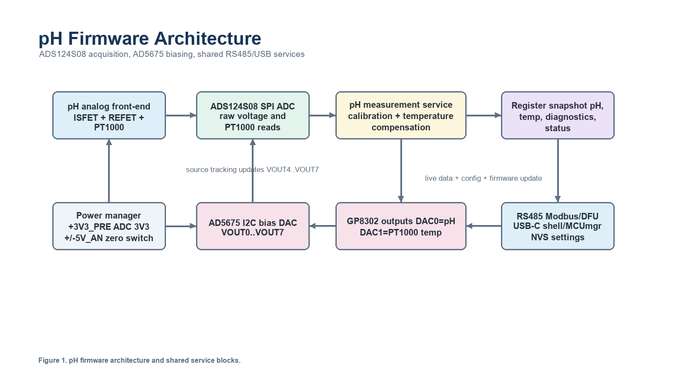
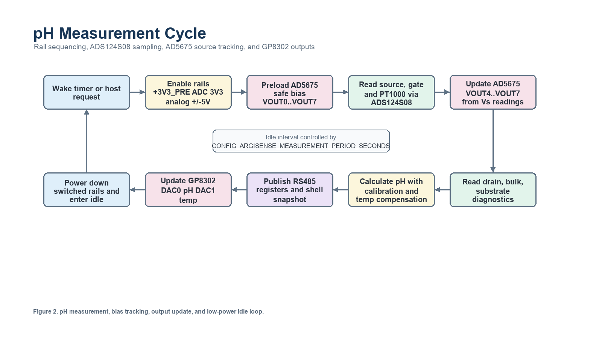
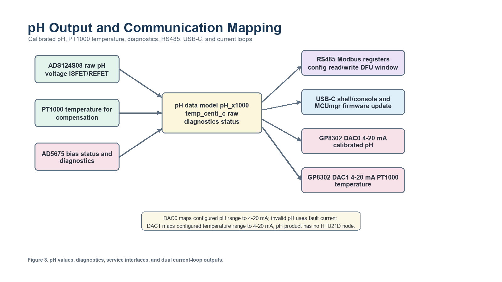

# ArgiSense pH Firmware Overview

This document describes the pH product profile on the `argisense_ph_u575rg`
board. It is intentionally separate from
`docs/methane-pressure-firmware-overview.md` so pH-specific analog-front-end
decisions do not get mixed with the Dynament methane sensor flow.

## Board Target

```text
argisense_ph_u575rg
```

The board is based on STM32U575RGT6 and the Sensor Platform V1 `pH_V1_0`
schematic. It keeps the same boot, flash, clock, debug, RS485, storage, and
service concepts as the methane + pressure board, but maps the measurement
front-end to pH-specific ADC/DAC hardware.

## Selected MCU Mapping

The schematic exports the pH analog-front-end nets as sheet-level ports
(`ADC_SPI_*`, `ADC_RESET`, `ADC_START`, `ADC_SRDY`, `DAC_I2C_*`,
`DAC_RESET`). The firmware mapping below assigns those ports to STM32U575RGT6
pins while keeping USB-C, SWD, debug UART, and RS485 away from pH analog
traffic:

| Function | Schematic signal | STM32U575RGT6 mapping | Zephyr node/property |
| --- | --- | --- | --- |
| Debug console | `STLK_UART_TX/RX` | `PA9/PA10` | `usart1` |
| RS485 TX/RX/DE | `O_C_UC_UART2_TXD`, `I_C_UC_UART2_RXD`, `O_C_UC_RS485_RnD1` | `PA2/PA3/PA1` | `usart2`, `rs485_modbus` |
| RS485 termination | `RS485_RESISTOR_EN` | `PB0` | `rs485-termination-gpios` |
| USB-C device | `USB2_P`, `USB2_N` | `PA12`, `PA11` | `otgfs` snippets |
| SWD | `MCU_SWDIO`, `MCU_SWCLK` | `PA13`, `PA14` | debugger |
| pH ADC SPI CS/SCLK/DOUT/DIN | `ADC_SPI_CS/SCLK/DOUT/DIN` | `PA4/PA5/PA6/PA7` | `ph_ads124s08` on `spi1` |
| pH ADC reset/start/ready | `ADC_RESET`, `ADC_START`, `ADC_SRDY` | `PB12`, `PB13`, `PB15` | `reset-gpios`, `start-sync-gpios`, `drdy-gpios` |
| pH bias DAC I2C | `DAC_I2C_SCL`, `DAC_I2C_SDA` | `PC0`, `PC1` | `ph_ad5675` on `i2c3` |
| pH bias DAC reset | `DAC_RESET` | `PC2` | `reset-gpios` |
| pH bias DAC LDAC | `LDAC*` | Not routed to MCU on pH_V1_0 | R73 0R ties LDAC low; optional `ldac-gpios` for future PCB |
| ADC clean 3V3 enable | `U_O_D_3V3_EN` | `PC3` | `adc-power-gpios` |
| Electrode zero switch | `ELECTRODE_ZERO_CTRL` | `PC4` | `electrode-zero-gpios` |
| MCU analog monitor | `MCU_ADC3_INP0` equivalent | `PC5 / ADC1_IN14` | `mcu-adc` |
| GP8302 DAC0 | `O_D_UC_I2C1_SCL/SDA` | `PB8/PB9` | `current-loop-dac0` |
| AT24C512C EEPROM | `MCU_I2C1_SCL/SDA` | `PB8/PB9` | `eeprom0` |
| GP8302 DAC1 | `O_D_UC_I2C2_SCL/SDA` | `PB10/PB14` | `current-loop-dac1` |
| Analog rail enable | `U_O_D_ANA_PWR_EN` | `PC9` | `analog-power-gpios` |
| DAC boost enable | `O_D_UC_PWR_DAC` | `PC6` | `dac-power-gpios` |
| DAC alarms | `O_D_DAC_ALARM1/2` | `PC7`, `PB2` | `dac-alarm-gpios`, `dac1-alarm-gpios` |
| Sensor/pre rail enable | `+3V3_PRE` control | `PC8` | `pre-power-gpios` |

The pH board uses the same `storage_partition` as the methane + pressure board
for Zephyr Settings/NVS through `zephyr,settings-partition`.
For the consolidated IO mapping and conflict list across both product variants,
see `docs/sensor-io-mapping.md`.

## pH Measurement Hardware

| Device | Bus | Address/CS | Purpose |
| --- | --- | --- | --- |
| ADS124S08IPBSR | `spi1` | CS0 / `PA4` | 24-bit ADC for ISFET, REFET, PT1000, and gate monitor |
| AD5675BCPZ-REEL7 | `i2c3` | `0x0c` | 8-channel pH bias DAC |
| REF3025AIDBZR | local reference | n/a | 2.5 V reference |
| LT3582EUD-5 | `i2c2` placeholder | `0x2c` placeholder | `+5V_AN` and `-5V_AN`; node remains disabled until address/programming is verified |
| GP8302 channel 0 | `i2c1` | `0x58` | 4-20 mA output for pH |
| GP8302 channel 1 | `i2c2` | `0x58` | 4-20 mA output for temperature or secondary value |
| AT24C512C | `i2c1` | `0x50` | External EEPROM |
| RS485 Modbus RTU | `usart2` | n/a | Service data, configuration, and future pH DFU/register map |

Schematic notes checked for the pH front-end:

- ADS124S08 is on sheet 10 and uses SPI plus `RESET`, `START/SYNC`, and `DRDY`.
- PT1000 is routed to ADS124S08 AIN2/AIN3, with a schematic note for 250 uA
  excitation current on AIN2.
- The pH product does not populate or use an HTU21D humidity IC. Ambient/process
  temperature for pH compensation comes from the PT1000 path through ADS124S08.
- AD5675 is on sheet 11, I2C address `0x0c`, with an external REF3025 2.5 V
  reference. Firmware configures AD5675 gain x1, so the code-to-output span is
  `0..2.5 V`.
- AD5675 `LDAC*` is not MCU-controlled on the current schematic. It is pulled
  low by the R73 0 ohm option and exposed at TP17. The driver supports optional
  `ldac-gpios`, but the current board DTS intentionally omits it until a PCB
  revision routes `LDAC*` to an MCU pin.
- AD5675 VOUT0/VOUT2 nominal setpoints are 448 mV for ISFET/REFET current
  sources; VOUT1/VOUT3 nominal setpoints are 500 mV for ISFET/REFET VDS
  control.

## ADS124S08 Channel Labels

| Label | Role |
| --- | --- |
| `AIN0_Vs_ISFET` | ISFET source measurement |
| `AIN1_Vs_REFET` | REFET source measurement |
| `AIN2_PT1000_P` | PT1000 positive input |
| `AIN3_PT1000_N` | PT1000 negative input |
| `ISFET_BULK_ADC` | ISFET bulk monitor |
| `ISFET_SUBS_ADC` | ISFET substrate monitor |
| `REFET_BULK_ADC` | REFET bulk monitor |
| `REFET_SUBS_ADC` | REFET substrate monitor |
| `ISFET_DRAIN_ADC` | ISFET drain monitor |
| `REFET_DRAIN_ADC` | REFET drain monitor |
| `GATE_BUFF_ADC` | Gate buffer output |

PT1000 uses the ADS124S08 IDAC path with 250 uA.

## AD5675 Bias Outputs

| Output | Role |
| --- | --- |
| `VOUT0_ID_SET_ISFET` | ISFET current source setpoint, nominal 448 mV |
| `VOUT1_VDS_SET_ISFET` | ISFET VDS setpoint, nominal 500 mV |
| `VOUT2_ID_SET_REFET` | REFET current source setpoint, nominal 448 mV |
| `VOUT3_VDS_SET_REFET` | REFET VDS setpoint, nominal 500 mV |
| `VOUT4_BULK_ISFET` | ISFET bulk bias, tracks `Vs_ISFET` reading |
| `VOUT5_SUBS_ISFET` | ISFET substrate bias, tracks `Vs_ISFET` reading |
| `VOUT6_BULK_REFET` | REFET bulk bias, tracks `Vs_REFET` reading |
| `VOUT7_SUBS_REFET` | REFET substrate bias, tracks `Vs_REFET` reading |

## pH Calculation Formula and Influencing Parameters

The firmware publishes `ph_x1000`, where a value of `7000` means pH 7.000.
The pH result is intentionally invalid until calibration mode is selected and
`ph_calibration_valid` is set. This prevents raw ADC voltage from being
mistaken for a calibrated chemical measurement.

### Raw pH Signal

The ADS124S08 measurement layer reads source and gate voltages first:

```text
VGS_ISFET_uV = gate_uV - vs_isfet_uV
VGS_REFET_uV = gate_uV - vs_refet_uV
```

The selected calibration mode then decides which raw signal feeds the pH
equation:

```text
mode 1, ISFET-REFET differential:
    ph_raw_uv = VGS_ISFET_uV - VGS_REFET_uV
              = vs_refet_uV - vs_isfet_uV

mode 2, reference-electrode:
    ph_raw_uv = VGS_ISFET_uV
```

For the current ISFET/REFET flow, mode 1 is the preferred bring-up path because
the REFET channel helps cancel common-mode drift from the shared gate/reference
node. Mode 2 is kept for a future reference-electrode topology or lab
diagnostic mode.

### PT1000 Temperature Compensation

PT1000 temperature is measured by ADS124S08 using the configured IDAC current
from devicetree. The current pH board uses `250 uA`.

```text
R_pt1000_mohm = pt1000_uv * 1000 / pt1000_idac_ua
temperature_centi_c = (R_pt1000_mohm - 1000000) * 100 / 3850
```

This is a linear IEC 60751 bring-up approximation around 0 degC. It is suitable
for firmware integration and early hardware bring-up, but final production
calibration should validate the PT1000 curve over the expected process
temperature range.

### PT1000 Bring-up and Service Reads

The pH firmware reads the PT1000 as a differential ADS124S08 measurement:

```text
ADS124S08 positive input: AIN2_PT1000_P
ADS124S08 negative input: AIN3_PT1000_N
ADS124S08 IDAC output:    AIN2_PT1000_P
IDAC current:             250 uA
```

The direct shell command for this path is:

```text
argisense ph adc 2 3 2
```

This means: read `AIN2 - AIN3` and enable the ADS124S08 IDAC on AIN2. The
normal measurement cycle uses the same path, then publishes the converted
temperature and raw PT1000 voltage into the pH service register map.

Useful service checks:

```text
argisense ph sample
argisense sensors
argisense rs485 12 2
argisense rs485 71 1
argisense rs485 104 3
```

Register meaning:

| Register | Meaning |
| --- | --- |
| `12..13` | `temperature_centi_c`, signed 32-bit PT1000 temperature |
| `71` | `temperature_last_error`, signed 16-bit last PT1000 read/conversion error |
| `75` | `ph_adc_status`; bit 2 is set when PT1000 conversion succeeded |
| `104..105` | `pt1000_uv`, signed 32-bit measured PT1000 voltage |
| `106` | `ph_operating_status`; includes pH operating-point/calculation bits |

Expected PT1000 voltage with 250 uA excitation:

| Temperature | Approx. PT1000 resistance | Approx. differential voltage |
| --- | ---: | ---: |
| 0 degC | 1000 ohm | 250 mV |
| 25 degC | 1096 ohm | 274 mV |
| 80 degC | 1308 ohm | 327 mV |

During bring-up, a reported temperature around `-259.74 degC` usually means
`pt1000_uv` is `0`, so the firmware is seeing no differential PT1000 voltage.
Check that PT1000 is actually connected between ADS124S08 AIN2/AIN3, the IDAC
path can source current into the PT1000 network, `ADC_RESET`, `ADC_START`,
`ADC_SRDY`, SPI, the ADC power rail, and the REF3025 reference are all valid.

The pH slope is adjusted by temperature before the final pH calculation:

```text
delta_centi_c = temperature_centi_c - ph_temp_reference_centi_c
temp_multiplier_ppm =
    1000000 + ph_temp_coeff_ppm_per_c * delta_centi_c / 100

slope_temp_uv_per_ph =
    ph_slope_uv_per_ph * temp_multiplier_ppm / 1000000
```

If PT1000 temperature is not valid, firmware uses `ph_temp_reference_centi_c`
instead and the `TEMP_COMP_USED` operating-status bit is not set.

### Final pH Equation

The calibrated pH equation used by firmware is:

```text
ph_base_x1000 =
    7000 + (ph_raw_uv - ph7_raw_uv) * 1000 / slope_temp_uv_per_ph

ph_x1000 =
    ph_base_x1000 * ph_slope_x1000 / 1000 + ph_offset_x1000

pH = ph_x1000 / 1000.0
```

`ph7_raw_uv` is the raw voltage measured at pH 7. `ph_slope_uv_per_ph` is the
raw voltage change per pH unit after calibration. Its sign must match the real
sensor response: if pH increases while `ph_raw_uv` decreases, store a negative
slope. The default `59000 uV/pH` is only a bring-up placeholder and the pH value
remains invalid until calibration is enabled.

### Validity Gates

pH output is marked valid only when all of these conditions pass:

- `ph_calibration_mode` is not disabled.
- `ph_calibration_valid` is `1`.
- `abs(slope_temp_uv_per_ph)` is at least `1000 uV/pH`.
- Raw ISFET/REFET reads are available.
- In ISFET-REFET mode, both ISFET and REFET VDS checks pass.
- In reference-electrode mode, the ISFET VDS check passes.

The operating-point check uses:

```text
VDS_ISFET_uV = isfet_drain_uv - vs_isfet_uv
VDS_REFET_uV = refet_drain_uv - vs_refet_uv
target VDS   = -500000 uV
tolerance    = +/-200000 uV
```

If these checks fail, the firmware keeps the pH value invalid and the current
loop uses the configured fault current instead of a misleading process value.

### Parameters That Affect pH

| Parameter | Default / source | Effect |
| --- | --- | --- |
| `ph_calibration_mode` | default `0`, disabled | Selects disabled, ISFET-REFET differential, or reference-electrode raw signal. |
| `ph_calibration_valid` | default `0` | Enables calibrated pH publishing after calibration data is known good. |
| `ph7_raw_uv` | default `0 uV` | Raw voltage offset captured in pH 7 buffer. |
| `ph_slope_uv_per_ph` | default `59000 uV/pH` | Main raw slope. Set sign and magnitude from two-point or multi-point pH calibration. |
| `ph_temp_reference_centi_c` | default `2500` | Reference temperature for the calibrated raw slope, normally 25.00 degC. |
| `ph_temp_coeff_ppm_per_c` | default `3354 ppm/C` | Temperature coefficient applied to the raw slope before pH calculation. |
| `ph_slope_x1000` | default `1000` | Final gain trim after the raw pH conversion. |
| `ph_offset_x1000` | default `0` | Final pH offset trim after the raw pH conversion. |
| `temperature_centi_c` | PT1000 through ADS124S08 | Enables temperature compensation when valid. |
| `vs_isfet_uv`, `vs_refet_uv`, `gate_uv` | ADS124S08 reads | Produce VGS and the raw pH signal. |
| `isfet_drain_uv`, `refet_drain_uv` | ADS124S08 reads | Used to verify VDS operating point before pH is accepted. |
| `VOUT4..VOUT7` | AD5675 source tracking | Bias bulk/substrate outputs from the measured source voltages, affecting analog operating point. |
| `ph_range_low_x1000`, `ph_range_high_x1000` | default `0..14000` | Do not change the pH calculation; only map calibrated pH to DAC0 4-20 mA output. |

### Suggested Calibration Sequence

1. Build and flash with the pH firmware profile.
2. Use `argisense ph sample` and raw RS485 registers to confirm the ADC, AD5675
   source tracking, PT1000 temperature, and VDS status bits are stable.
3. Put the probe in a pH 7 buffer, wait for settling, then store the measured
   `ph_raw_uv` as `ph7_raw`.
4. Put the probe in a second buffer, for example pH 4 or pH 10, and compute:

```text
ph_slope_uv_per_ph =
    (ph_raw_uv_buffer2 - ph7_raw_uv) / (pH_buffer2 - 7.0)
```

5. Set `ph_cal_mode` to `1` for ISFET-REFET differential mode, write the
   calibrated `ph7_raw` and `ph_slope_uv`, then set `ph_cal_valid` to `1`.
6. Recheck pH 7 and the second buffer. Use `ph_slope` and `ph_offset` only for
   small final production trims after the raw slope and pH7 offset are correct.

## Current Firmware State

The board now builds with a dedicated pH firmware profile under
`app/products/ph/src`.
It verifies the pH devicetree topology, initializes persistent pH settings,
starts a Modbus RTU server on RS485, publishes a pH-specific holding-register
map, and registers pH shell diagnostics.

The pH firmware uses the same service connectors as the methane + pressure
firmware:

- USART2 RS485 for Modbus configuration, live-data reads, service commands, and
  RS485 DFU register writes.
- USB-C CDC ACM for shell/console with the `usbconsole` profile.
- USB-C composite CDC ACM for shell/console plus MCUmgr firmware update with
  the `usbupdate` profile.

ADS124S08 and AD5675 protocol drivers are now implemented as out-of-tree
Zephyr module drivers:

- `drivers/adc/ads124s08.c` provides reset, register read/write, single-shot
  conversion, DRDY polling, raw 24-bit sign extension, raw-to-microvolt
  conversion, and a minimal Zephyr ADC API surface.
- `drivers/dac/ad5675_i2c.c` exposes the AD5675 as an 8-channel 16-bit Zephyr
  DAC API device and writes each channel with the AD5675 write-and-update I2C
  command.
- `app/products/ph/src/ph_measurement.c` powers the pH analog rails, applies
  safe initial AD5675 bias values, reads ISFET/REFET source and gate, updates
  VOUT4..VOUT7 from the measured source voltages, reads drain, bulk,
  substrate, and PT1000 diagnostics, then publishes raw voltages, temperature,
  pH status, and calibration-gated pH into the pH register snapshot.
- `app/products/ph/src/current_loop_output.c` maps the measured values to the
  two GP8302 current-loop outputs: DAC0 outputs calibrated pH and DAC1 outputs
  PT1000 temperature.

The pH value remains invalid until calibration is explicitly enabled. The
firmware stores pH7 raw offset, raw slope in uV/pH, temperature reference,
temperature coefficient, calibration mode, and calibration-valid state in NVS.
This avoids publishing a pH value that looks valid but is only a raw voltage
placeholder.

DAC output behavior:

| Output | Source | Valid behavior | Invalid behavior |
| --- | --- | --- | --- |
| GP8302 DAC0 | Calibrated pH, `ph_x1000` | Maps `ph_range_low_x1000..ph_range_high_x1000` to `dac_min_ua..dac_max_ua` | Outputs `dac_fault_ua` until pH calibration is valid |
| GP8302 DAC1 | PT1000 temperature, `temperature_centi_c` | Maps `temperature_range_low_centi_c..temperature_range_high_centi_c` to `dac_min_ua..dac_max_ua` | Outputs `dac_fault_ua` if PT1000 read fails |

With defaults, DAC1 maps `0.00..80.00 degC` to `4..20 mA`. Change this range
from shell or RS485 with the `temp_low` and `temp_high` settings.

Build command:

```bat
py -3.12 -m west build -p always -b argisense_ph_u575rg argisense-zephyr-app
```

Equivalent project script command:

```bat
argisense-zephyr-app\app\compile.bat ph
```

USB-C shell and update builds:

```bat
argisense-zephyr-app\app\compile.bat ph usbconsole
argisense-zephyr-app\app\compile.bat mcuboot ph usbupdate
argisense-zephyr-app\app\compile.bat mcuboot ph hsi usbupdate
```

## System Illustrations







## pH Service Register Map

The pH firmware uses device ID `0xA652` and register map version `3`. Multi-word
values are high word first.

| Range | Purpose |
| --- | --- |
| `0..38` | Identity, status, live pH/temperature snapshot, firmware version, RS485 serial settings, calibration mode, calibration-valid flag, and service command register |
| `40..67` | pH range, temperature range, output correction slope/offset, raw pH7 offset, raw uV/pH slope, temperature compensation settings, and DAC trim settings |
| `70..76` | pH and PT1000 temperature error/status registers; `72..74` are reserved because the pH product has no HTU21D humidity sensor |
| `80..106` | Raw pH diagnostics: raw pH voltage, VGS ISFET/REFET, source/gate/drain/bulk/substrate voltages, PT1000 voltage, and operating-point status |
| `1000..` | Shared RS485 DFU window when built with MCUboot and `CONFIG_ARGISENSE_RS485_DFU=y` |

Writable RS485 settings are stored through Zephyr Settings/NVS under the pH
namespace `argisense_ph/config`, separate from the methane + pressure settings
namespace. Baudrate, unit ID, data-bit, parity, and stop-bit writes are saved
immediately but require reboot before the running Modbus server uses the new
transport parameters.

Shell commands:

```text
argisense drivers
argisense sensors
argisense rs485
argisense rs485 1000 36
argisense settings
argisense settings get ph_high
argisense settings set ph_cal_mode 1
argisense settings set ph7_raw 0
argisense settings set ph_slope_uv 59000
argisense settings set ph_cal_valid 1
argisense settings set temp_low 0
argisense settings set temp_high 8000
argisense settings set address 2
argisense settings reset
argisense ph adc 0
argisense ph adc 2 3 2
argisense ph dac 0 448
argisense ph zero 1
argisense ph sample
```

## Proposed pH Measurement Flow

1. Power and settle:
   enable `+3V3_PRE`, ADC clean 3.3 V, and `+/-5V_AN`; wait the configured
   analog settle time.
2. Safe bias preload:
   configure all eight AD5675 channels, then set VOUT0/VOUT2 to 448 mV and
   VOUT1/VOUT3 to 500 mV. Preload VOUT4..VOUT7 to 0 mV before the first ADC
   source reading.
3. Electrode zero check:
   use `ELECTRODE_ZERO_CTRL` as a service/calibration mode to short or release
   the electrode input path, then capture ADC offset data.
4. Temperature read:
   configure ADS124S08 for AIN2/AIN3 differential, enable 250 uA IDAC on AIN2,
   read the 24-bit conversion, convert voltage to PT1000 resistance, then use
   the PT1000 temperature equation. The current firmware uses a linear
   bring-up approximation around 0 degC.
5. ISFET/REFET read:
   read `AIN0_Vs_ISFET`, `AIN1_Vs_REFET`, and `GATE_BUFF_ADC`, then rewrite
   VOUT4/VOUT5 to the measured `Vs_ISFET` and VOUT6/VOUT7 to the measured
   `Vs_REFET`. After the source-tracking outputs settle, read drain, bulk,
   and substrate monitor channels. The current raw differential value is
   `VGS_ISFET - VGS_REFET`, which simplifies to `Vs_REFET - Vs_ISFET` when
   both FETs share the same gate/reference node.
6. Closed-loop pH calculation:
   verify the ISFET/REFET VDS monitor is near `-0.5 V`, then calculate pH only
   when calibration mode and calibration-valid are enabled. Calibration stores
   pH7 raw offset, uV/pH slope, and temperature compensation settings.
7. Publish and output:
   write the final calibrated pH and PT1000 temperature into the RS485 register
   map, update GUI graph values, then map pH to GP8302 DAC0 and PT1000
   temperature to GP8302 DAC1.

## Next Firmware Work

1. Validate ADS124S08 SPI mode, DRDY timing, REF3025 reference polarity, and
   PT1000 IDAC routing on hardware.
2. Calibrate real pH7 raw offset and slope using buffer solutions and confirm
   the sign of `ph_slope_uv_per_ph`.
3. Validate the VDS tolerance window with a DMM/scope before relying on the
   `ph_valid` bit.
4. Add optional GUI diagnostic fields for gate voltage, ISFET/REFET voltages,
   PT1000 raw voltage, and pH output current after the raw diagnostic UX is
   finalized.
